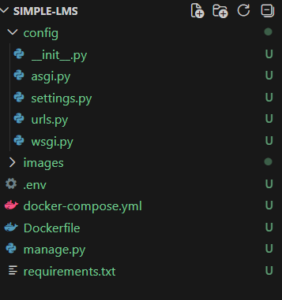
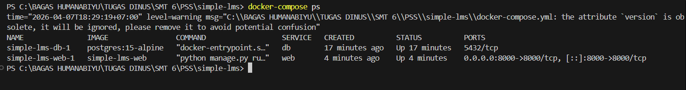
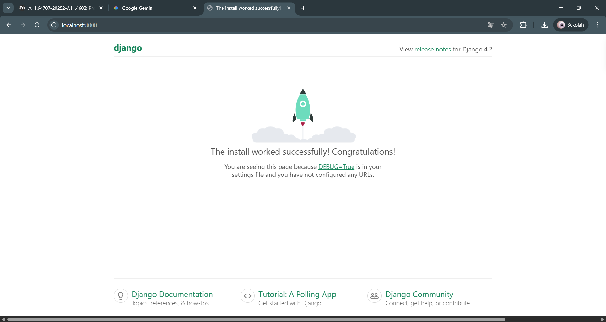

# Simple LMS - Django & PostgreSQL with Docker

Project ini adalah inisialisasi lingkungan pengembangan (development environment) menggunakan Django Framework dan Database PostgreSQL yang dijalankan di dalam container Docker.

## 🎯 Learning Objectives
- Memahami containerization dengan Docker.
- Implementasi Dockerfile dan Docker Compose untuk aplikasi Python/Django.
- Konfigurasi koneksi database PostgreSQL di dalam ekosistem Docker.

---

## 📂 Project Structure
```text
simple-lms/
├── config/             # Folder inti Django (settings, urls, wsgi)
├── postgres_data/      # Data persistensi PostgreSQL (auto-generated)
├── docker-compose.yml  # Orkestrasi container
├── Dockerfile          # Instruksi build image Django
├── manage.py           # Django management script
├── requirements.txt    # Library Python (Django, Psycopg2)
└── README.md           # Dokumentasi project

🖼️ Bukti Implementasi (Screenshots)
1. Project Structure (VS Code)
Menunjukkan struktur folder yang sesuai dengan standar best practice Django.


2. Docker Services RunningMenunjukkan container web dan db berjalan normal (Output docker ps).


3. Django Welcome PageWebsite Django berhasil diakses melalui http://localhost:8000.


⚙️ Environment Variables Explanation
Dalam file docker-compose.yml, kita menggunakan variabel berikut untuk menghubungkan Django ke Database:
DB_NAME: Nama database (lms_db)

DB_USER: User database (lms_user)

DB_HOST: Service name database (db)

🚀 Cara Menjalankan ProjectClone Repository:Bashgit clone <url-repository-anda>
cd simple-lms
Build dan Jalankan Container:PowerShelldocker-compose up -d --build
Jalankan Migrasi Database:(Penting agar tabel Django terbentuk di PostgreSQL)PowerShelldocker-compose exec web python manage.py migrate
Akses Website:Buka browser di alamat http://localhost:8000.


BAGAS HUMANABIYU (A11.2023.15392)